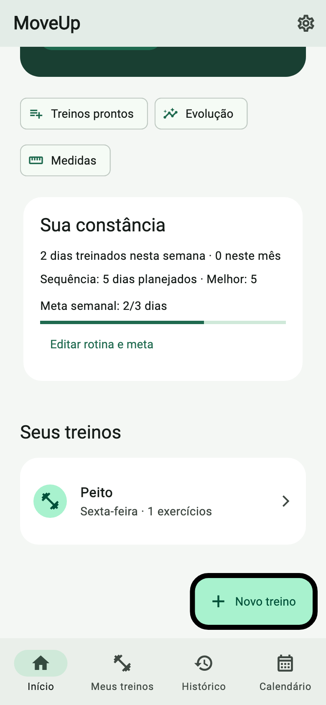
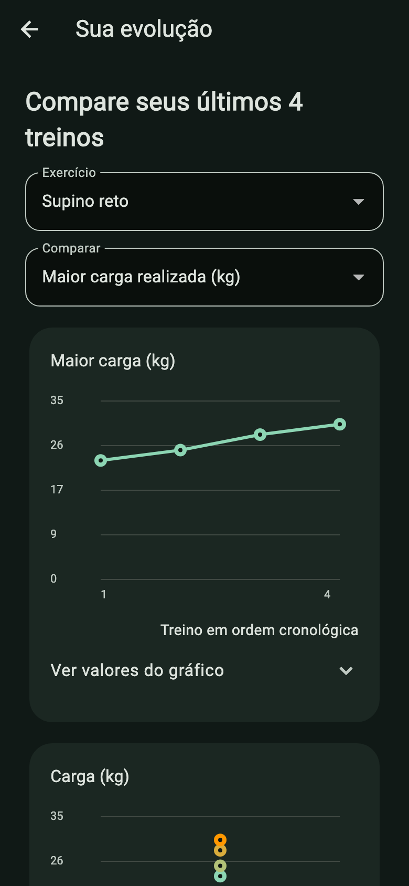
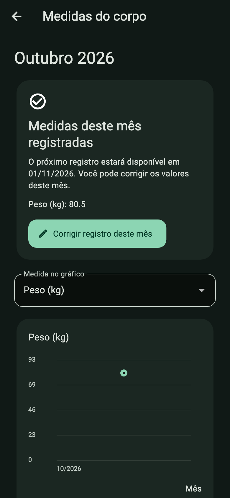
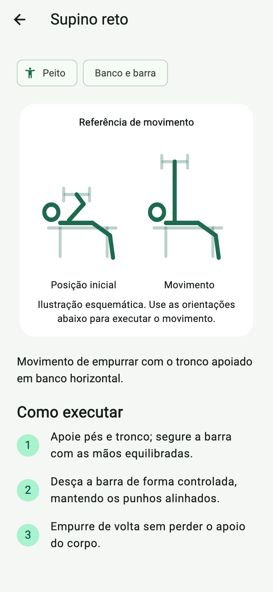

# MoveUp

**Seu próximo passo começa aqui.** O MoveUp ajuda você a organizar os treinos,
registrar cada série e acompanhar sua evolução com uma experiência feita para
celular. Este é o aplicativo Flutter do projeto; a API complementar está em
[JoaoPSchiavoni/MoveUp](https://github.com/JoaoPSchiavoni/MoveUp).


## O que você pode fazer

- Montar fichas ou começar com modelos ABC, superior/inferior e corpo inteiro.
- Registrar carga e repetições durante o treino, com timer de descanso circular.
- Consultar histórico, calendário e sequência OnFire de treinos planejados.
- Explorar instruções dos exercícios e ver seu progresso em gráficos.
- Registrar medidas corporais mensais, com histórico de evolução.
- Escolher modo claro, escuro ou automático.
- Usar o banco local no celular, exportar um backup e restaurá-lo depois.

| Início | Desempenho | Medidas | Exercício |
|---|---|---|---|
|  |  |  |  |

## Começar

Requisitos: Flutter instalado. Na pasta do projeto, execute:

```sh
flutter pub get
flutter run
```

Por padrão, as fichas, sessões, rotina, tema e medidas ficam no banco SQLite do
dispositivo. O app funciona sem configurar uma API. O emulador Android, iOS,
desktop e web podem ser executados pelo Flutter conforme as plataformas
configuradas no ambiente.

Para conferir o app com dados demonstrativos em memória:

```sh
flutter run --dart-define=USE_PREVIEW=true
```

Para conectar à API MoveUp, inicie primeiro o serviço de [Back-end](https://github.com/JoaoPSchiavoni/MoveUp)
e passe um endereço acessível pelo aparelho:

```sh
flutter run --dart-define=USE_REMOTE_API=true --dart-define=API_BASE_URL=http://localhost:5013
```

No emulador Android, o endereço padrão da API é `http://10.0.2.2:5013`;
`localhost` em um telefone físico aponta para o próprio telefone. Em Preferências,
**Trazer dados da API** importa a biblioteca para o armazenamento local vazio.
Essa transferência não mantém sincronização automática.

No navegador, os dados ficam no armazenamento daquele site; limpar os dados do
site também remove o banco local. Use **Preferências → Exportar backup** para
guardar uma cópia. O Flutter não carrega `.env` por conta própria. Para opções
de compilação, use `--dart-define` ou `--dart-define-from-file`; não inclua
credenciais ou segredos no aplicativo.

## Tecnologia

Flutter e Dart para as interfaces multiplataforma; SQLite local com Drift para
armazenamento no dispositivo; integração HTTP opcional com o serviço ASP.NET Core.
Os dados importados da API passam a pertencer ao banco local do aparelho.

## Documentação

- [Visão de produto, arquitetura local e limites conhecidos](docs/local-product.md)
- [Brainstorm e escopo do produto](docs/product-brainstorm.md)
- [Integração entre aplicativo e API](docs/front-back-integration.md)
- [Contrato de sessões](docs/phase-2-session-api.md)
- [Plano do calendário e consistência](docs/phase-3-consistency-plan.md)

## Verificar e gerar versões

```sh
flutter analyze
flutter test
flutter build apk --release
flutter build ios --release
flutter build web --release
```

Uma compilação iOS requer macOS e Xcode. Os passos de build e execução local
estão nos guias acima; nenhuma credencial de assinatura deve ser enviada ao Git.
